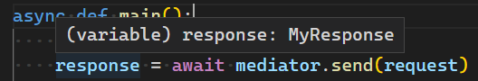

Getting started
===============

Currently, *mediatpy* supports :doc:`REPR pattern </repr>`, :doc:`pipeline </pipeline>`, and :doc:`notifications </notifications>`.

Also, it's prepared for integration with third-party :doc:`dependency injection </dependency_injection>` containers through custom factories.

The library has been created using `generics <https://docs.python.org/3.10/library/typing.html#building-generic-types>`_ and using `mypy <http://mypy-lang.org/>`_ to validate types. This means, that you will have autocomplete in editors that support it.

Installation
------------

``pip install mediatpy``

Example
-------

.. code-block:: python

    import asyncio

    from mediatpy import Request, RequestHandler, Mediator

    class MyResponse:
        pass

    class MyRequest(Request[MyResponse]):
        pass

    mediator = Mediator()

    @mediator.request_handler
    class MyRequestHandler(RequestHandler[MyRequest, MyResponse]):
        async def handle(self, request: MyRequest) -> MyResponse:
            return MyResponse()

    async def main():
        request = MyRequest()
        response = await mediator.send(request)
        assert isinstance(response, MyResponse)

    if __name__ == '__main__':
        asyncio.run(main())